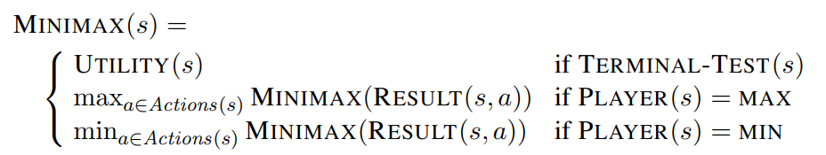
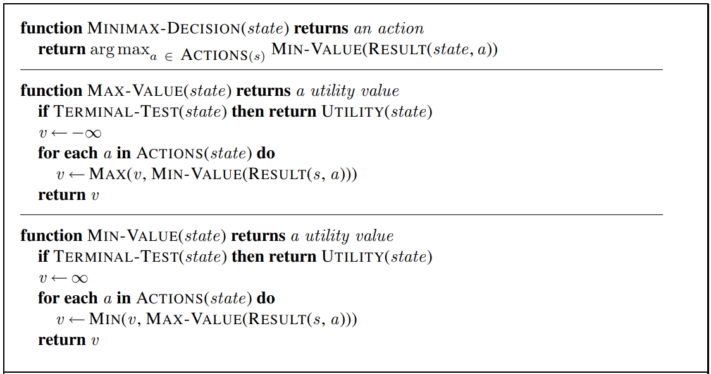
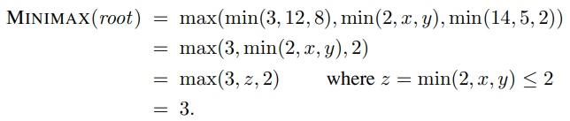
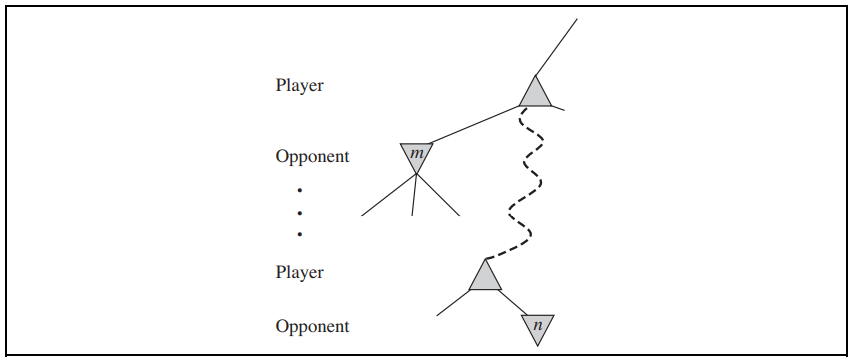
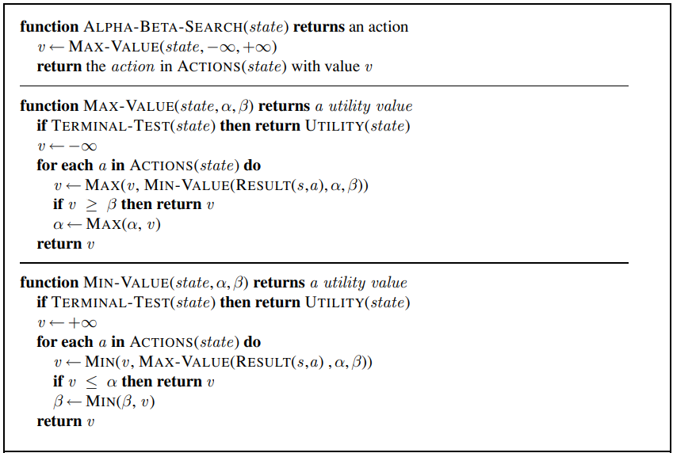

# Adversarial Search

> **Quick links**
> - [Edunex](https://edunex.itb.ac.id/courses/43590/preview/100868/42976)
> 	- [Slide](https://cdn-edunex.itb.ac.id/31964-Artificial-Intelligence-Parallel-Class/24045-Minggu-4/16362-Beyond-Classical-Search-Part-2/1631021993499_IF3170_Materi04_AdversarialSearchpptx.pdf)

## Games
Dalam lingkungan multiagent, agent harus mempertimbangkan aksi-aksi agent lain dan efeknya terhadap agent tersebut. Agent-agent dalam lingkungan multiagent memungkinkan lingkungan menjadi kompetitif ketika agent-agent memiliki tujuan yang saling konflik satu sama lain sehingga timbul masalah **adversarial search**, yang sering dikenal sebagai **games**. Dalam AI, game-game yang umum adalah jenis game tertentu, yang disebut deterministic, turn-taking, two-player, **zero-sum games** of **perfect information**; misalnya catur.

```admonish info
*Zero-sum* pada zero-sum games berarti selalu memiliki *payoff* yang sama atau konstan. Dalam catur, skor akhir antar pemain yang mungkin adalah $1-0$, $\frac{1}{2}-\frac{1}{2}$, dan $0-1$ sehingga jumlahnya selalu konstan yaitu $1$. 
```

Sebuah game dapat didefinisikan sebagai semacam permasalahan pencarian dengan elemen-elemen berikut.
- $S_0:$ **initial state**, yang mendefinisikan bagaimana game disusun/dipersiapkan pada awalnya.  
- $Player(s):$ mendefinisikan pemain mana yang bergerak pada suatu state.  
- $Actions(s):$ mengembalikan himpunan gerakan '*moves*' yang legal pada suatu state.  
- $Result(s, a):$ **model transisi**, yang mendefinisikan hasil dari sebuah gerakan.  
- $Terminal-Test(s):$ fungsi **uji terminal**, yang bernilai `true` jika game telah berakhir dan `false` selainnya. State-state ketika game telah berakhir disebut *terminal states*.  
- $Utility(s, p):$ **fungsi utilitas** (disebut juga fungsi objektif atau fungsi *payoff*), mendefinisikan nilai numerik akhir suatu game yang berakhir pada terminal state $s$ untuk pemain $p$.

Initial state, fungsi $Actions$, dan fungsi $Result$ mendefinisikan pohon permainan atau **game tree** untuk suatu game, yaitu tree yang node-nya adalah state-state game dan edge-nya adalah gerakan-gerakan pada game.

## Optimal Decision in Games
Diberikan sebuah game tree, strategi optimal dari game tersebut dapat ditentukan dengan **nilai minimax** setiap node, yang dituliskan sebagai $Minimax(n)$. Nilai minimax (untuk salah satu pemain) suatu node adalah nilai utilitas jika berada pada state tersebut, *dengan asumsi bahwa kedua pemain berimain secara optimal* dari sana hingga akhir game. Jika terdapat dua pemain: `MAX` yang memilih untuk bergerak ke state dengan nilai maksimum dan `MIN` yang memilih untuk bergerak ke state dengan nilai minimum, nilai minimax didefinisikan sebagai berikut.



### Minimax algorithm
**Algoritma minimax** menghitung keputusan minimax dari state saat ini. Algoritma tersebut menggunakan perhitungan rekursif sederhana yang menghitung nilai minimax untuk setiap state successor, dengan mengimplementasi secara langsung persamaan yang mendefinisikannya. Rekursi terus berlanjut hingga ke daun-daun game tree kemudian nilai-nilai minimax dikembalikan setelah rekursi berakhir. Berikut adalah algoritma minimax dalam bentuk pseudocode.



Algoritma minimax melakukan eksplorasi komplit depth-first pada game tree. Jika kedalaman maksimum tree tersebut adalah $m$ dan ada $b$ gerakan legal pada setiap state/node, maka kompleksitas waktu algoritma minimax adalah $O(b^m)$. Kompleksitas ruang untuk algoritma yang men-*generate* semua aksi sekaligus adalah $O(bm)$ atau $O(m)$ untuk algoritma yang men-generate satu aksi pada satu waktu.

```admonish
Secara sederhana algoritma minimax adalah pertanyaan rekursif:  
*If I do this move now, what is the best move that my opponent will play next?*
```

## Alpha-Beta Pruning
Permasalahan dengan algoritma minimax adalah banyaknya state game yang harus diperiksa adalah eksponensial dari kedalaman game tree. Kita dapat memotong setengah ekponensial ini dengan teknik yang disebut **alpha-beta pruning**. Perhatikan perhitungan minimax decision berikut.



Pada perhitungan di atas, nilai minimax tidak dipengaruhi oleh nilai $x$ dan $y$ sehingga perhitungan nilai $x$ dan $y$ dapat dipangkas '*pruned*'. Sebagai ilustrasi tambahan, misalkan kita bermain sebuah permainan dengan game tree sebagai berikut.



Jika node $m$ adalah node yang lebih baik dari node $n$ bagi kita, maka kita tidak akan pernah sampai pada node $n$ dalam permainan. Artinya, jika kita telah mendapatkan informasi yang cukup seputar $n$ untuk mendapatkan kesimpulan ini, kita dapat memangkas node $n$. Secara umum, berikut adalah pseudocode algoritma $\alpha\beta$-search.



```admonish
Tinjau game tree sebagai tree yang terdiri atas node-node kedalaman ganjil dan genap. Algoritma minimax akan memaksimalkan nilai minimax node kedalaman ganjili dan meminimalkan nilai minimax node kedalaman genap. Dengan demikian, $\alpha\beta$-search adalah pertanyaan rekursif pada node kedalaman ganjil:  
*If I know that this node worth at least $k$, which child node worth at most less than $k$ so I don't need to bother expanding?*  
dan pada node kedalaman genap:  
*If I know that this node worth at most $k$, which child node worth at least more than $k$ so I don't need to bother expanding?*
```