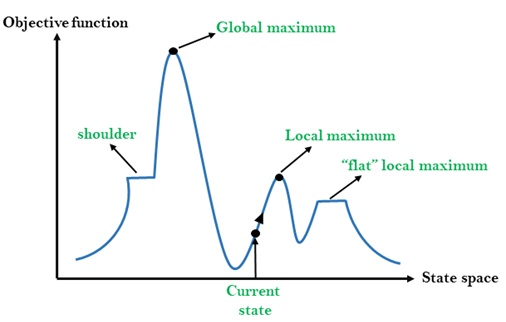

# Hill Climbing Search

>TODO: Fix horizontal bar unicode.

*Hill Climbing Search* dimulai dengan initial state yang di-*generate* secara random. Kemudian dilakukan "pendakian" (perpindahan) ke neighbor terbaik―ke arah value yang menaik (nilai objektif) atau menurun (nilai cost)―dari current state secara terus menerus hingga tidak ada lagi neighbor yang tidak memliki nilai yang lebih baik, yaitu pada *peak*. Sebagai contoh, pada gambar di bawah, hill climbing search akan melakukan pendakian dari current state ke arah kanan hingga berhenti di *local maximum*.



Berikut adalah pseudocode algoritma hill-climbing search.
```
function HILL-CLIMBING(problem) returns a state that is a local maximum
	current <- problem.INITIAL
	while true do
		neighbor <- a highest-valued successor state of current
		if VALUE(neighbor) <= VALUE(current) then return current
		current <- neighbor
```

Pencarian dengan hill climbing sukses jika state global maximum tercapai. Pencarian juga mungkin *stuck* pada
1) local maximum,
2) flat local maximum, dan
3) shoulder.
Akan tetapi, global maximum masih dapat tercapai jika final state yang dicapai adalah shoulder. Oleh karena itu, ada variasi lain hill climbing search yang memperbolehkan memilih neighbor dengan nilai yang sama dengan current state.

## Variant 1: Hill-Climbing Search with Sideways Move
Dalam pencarian hill climbing dengan *sideways move*, pencarian tidak dihentikan jika masih ada neighbor dengan nilai state yang sama dengan current state. Dengan demikian, pencarian hanya berhenti ketika telah dicapai state yang merupakan "peak", tetapi tidak dengan state yang "flat". Perhatikan bahwa kondisi $VALUE(neighbor) \leq VALUE(current)$ diubah menjadi  $VALUE(neighbor) \lt VALUE(current)$ pada pseudocode varian ini sebagai berikut.

```
function HILL-CLIMBING(problem) returns a state that is a local maximum
	current <- problem.INITIAL
	while true do
		neighbor <- a highest-valued successor state of current
		if VALUE(neighbor) < VALUE(current) then return current
		current <- neighbor
```

## Variant 2: Random Restart Hill-Climbing Search
Pada varian ini, pencarian dilakukan berdasarkan ide berikut.

>*If at first you don't succeed, try, try again.*

Dengan demikian, varian ini melakukan serangkaian hill climbing search dengan initial state random hingga goal ditemukan. Ekspektasi banyaknya restart yang diperlukan adalah $1/p$ dan ekspektasi banyak langkah yang dilakukan untuk mencapai goal adalah cost dari 1 iterasi sukses ditambah dengan $(1 - p)/p$ kali cost dari iterasi gagal, dengan $p$ adalah peluang untuk sukses mencapai goal (tidak stuck).

## Variant 3: Stochastic Hill-Climbing Search
Pada varian ini, hanya ada 1 neighbor dari current state, yang merupakan salah satu successor yang dipilih secara random. Jika neighbor yang dipilih memiliki value yang lebih baik dari current state, maka pencarian dilanjutkan dengan neighbor sebagai current state; jika tidak, maka neighbor diabaikan dan pencarian dilanjutkan pada iterasi berikutnya. Pencarian ini dihentikan jika iterasi telah mencapai batas yang telah ditentukan, dengan pseudocode sebagai berikut.

```
function HILL-CLIMBING(problem) returns a state that is a local maximum
	current <- problem.INITIAL
	repeat nmax times
		neighbor <- random successor state of current
		if VALUE(neighbor) > VALUE(current) then
			current <- neighbor
```